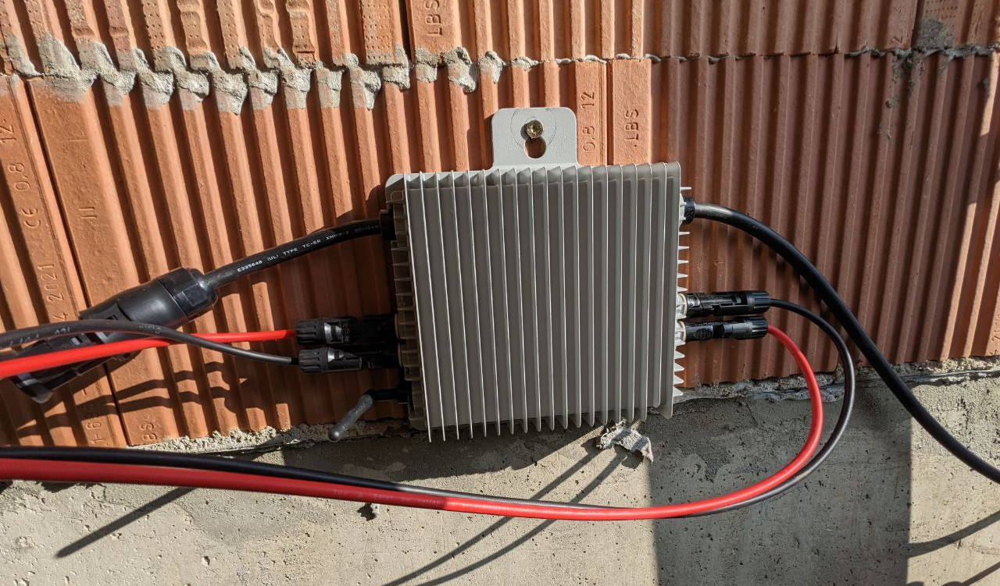
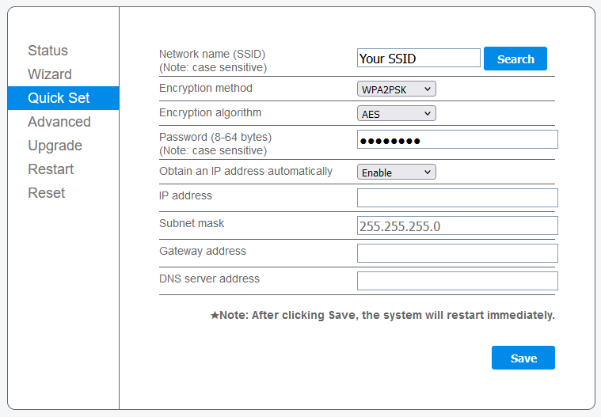
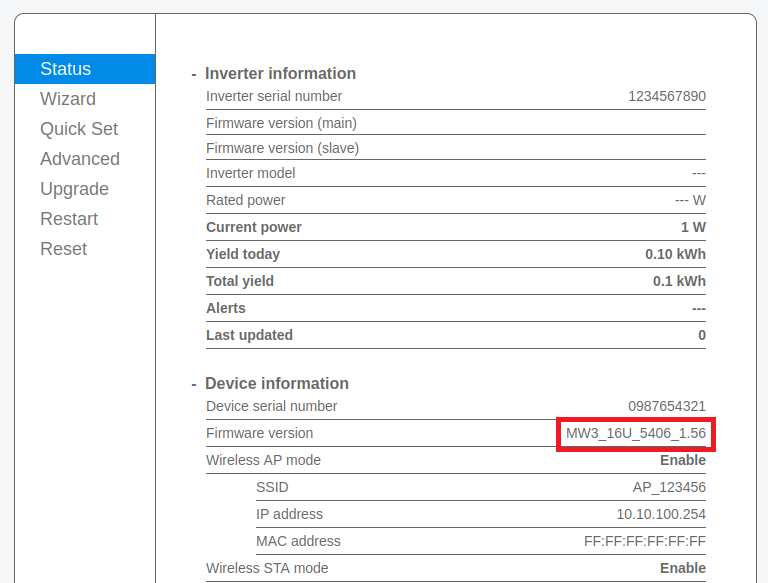
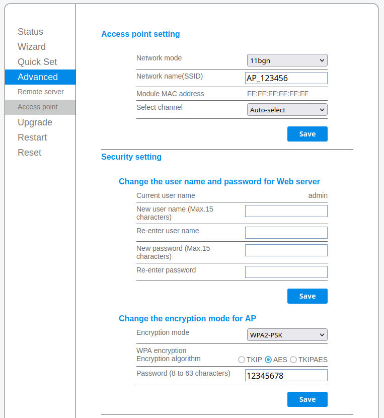
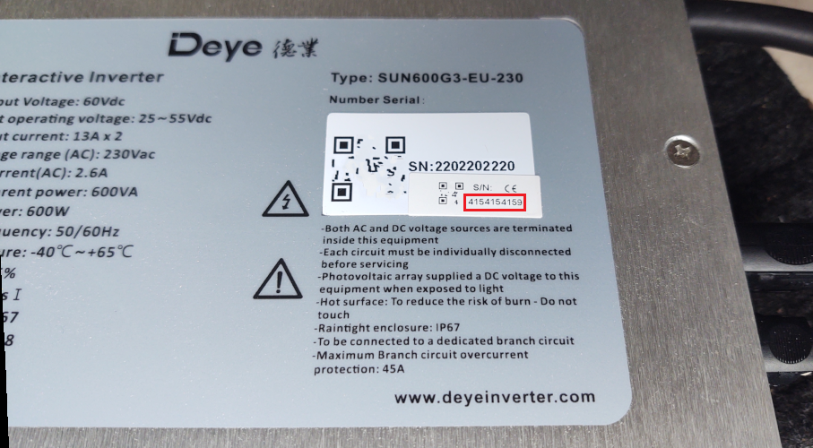

# Deye Microinverter - Cloud-free



Solar power generation work best if there are no clouds anywhere to be seen :)
<br/><br/>

This repository aims to document how to use Deye microinverters entirely local only and cloud free.
It consolidates the knowledge that at the time of writing was spread over hundreds of different posts, issues and comments.

As of now it will unfortunately still require you to block traffic in your router, however you won't have to install any apps or create any accounts.
You also won't have to share any e-mail address or phone number.

## Devices

So far, the following devices are known to work like this:

- Deye SUN600G3-EU-230

it should also be the same for other inverters of the same series including rebrands such as Bosswerk.<br/>
If you have verified that it works with another device, feel free to extend this list.

## TL;DR

Here are the main things you will want to know about these microinverters:

- They have Wi-Fi
- They can be connected to Wi-Fi networks via their webinterface
- They can operate without an internet connection
- They can operate without an account
- They can be monitored and controlled via ModbusTCP

## Preamble

Compared to traditional PV setups where a single large inverter is connected to strings of many PV Panels, in a microinverter Setup, you have one small inverter for every 1-4 PV Panels.

There are up- and downsides to both of these topologies but that is for now out of scope for this document.
What you need to know is that microinverters are cheaper and scaled-down versions of their larger brothers.

Because they only cost 150-200€ they make getting into solar power generation accessible for many more people than ever before.
Paired with two PV Panels you're looking at an investment of at most 1000€ to get free energy from the sun.

Additionally, because you only need few panels for the setup to make sense financially, often a balcony or garden can be enough for a small solar setup.
This is especially interesting for people living in rental properties.

### Word of warning

After reading through way too many concerning posts and comments, here's what has to be said:

**Please** please please don't cut any corners when it comes to safety-critical stuff such as cabling and also mounting panels.
You don't want your home to burn down or anyone to be killed by a falling 1.5m² 25kg PV Panel.

Electricity is dangerous. So are heavy things with a huge attack surface for wind.<br/>
When in doubt, contact a local electrician. They know what they're doing and will help you.

If people do stupid stuff with this technology, it **will become inaccessible** to every one of us, as there will be legislation preventing further idiot-induced injuries/harm, **ruining everything** for the vast majority of reasonable users.


## Setup

Now with that out of the way, we can talk about what to do.

The first important thing to note is that these inverters will shut down if they don't sense at least 20V on at least one PV input.
This means that you have to do all this during the day connected while connected to a PV panel.

Alternatively, some people reported that they got the inverter to wake up by connecting a 30V lab power supply to one of the PV inputs.

### Joining Wi-Fi

By default, your microinverter should provide a Wi-Fi Access point with an SSID named similarly to `AP_4151234567`.
Using a laptop, connect to that using the default AP password `12345678`.

In a browser, navigate to the IP of the inverter in that network which should by default be `http://10.10.100.254/`.
Log in to the webinterface with the default credentials `admin:admin` and use that to configure Wi-Fi.



The AP-mode can be a bit unstable so prepare for the webinterface stopping to work occasionally.
Once the inverter is connected to you Wi-Fi, this should not be an issue anymore.


### Ensuring a patched logger firmware

After joining the inverter to you Wi-Fi network, connect to the webinterface again but this time using the IP in your network.

Now, expand the `Device Information` on the `Status` page and ensure that your logger firmware version is at least `MW3_16U_5406_1.53` or newer.



Older firmwares don't allow reconfiguration of the Wi-Fi AP, which is a a serious vulnerability, as it allows an attacker to easily gain access to your real Wi-Fi credentials.

If your firmware is older, you can find firmware update files in this repo: [https://github.com/dasrecht/deye-firmware](https://github.com/dasrecht/deye-firmware).
You can flash them using the `Upgrade Firmware` page of the webinterface.


### Securing the AP

With the logger firmware upgraded, you should now use the webinterface to change SSID and Password for the AP of the inverter.



Pick something not immediately obvious and relatively secure as - as mentioned before - it is all that prevents an attacker from connecting to that AP and reading out your main Wi-Fi credentials.

I have been told that you can also use the wizard to disable the AP entirely, however personally, I like having a fallback way into the inverter, especially since I did not see a "Factory Reset" button on the device.


### Configuring your network

Now that the AP is secured, use the configuration interface of your router to block internet access of the inverter.
You will also likely want to configure it, so that it will always get the same IP assigned via DHCP.

These things should be dropdowns and checkboxes in most consumer routers.
If you run some advanced setup, you will know what to do.

You can also try to DNS-block `access1.solarmanpv.com` and `access2.solarmanpv.com`, however it seems that the logger firmware might also use hardcoded IPs?
Either way, just blocking internet access entirely should be much easier in most setups anyway and comes with no known downsides.

## Usage

After connecting the inverter to your Wi-Fi network, securing it and blocking its internet access, all you need to do now is monitor and control it.
This can be done via ModbusTCP in a slightly custom way that uses the inverter logger serial number for authentication.

To get this serial, simply look at the sticker on the device:



If you feel like doing something arcane and/or want to build something for that yourself, you can find the Modbus spec for these inverters in the complementary assets repo:
[https://github.com/Hypfer/deye-microinverter-cloud-free-assets](https://github.com/Hypfer/deye-microinverter-cloud-free-assets).

Note that with internet access blocked, the inverter never receives any time information.
This breaks the `Yield today` counter as it will never properly reset unless you manually set the time on each boot using modbus register `22`, `23` and `24`.


### With Home Assistant

With Home Assistant, the easiest way to get your inverter connected is by using [HACS](https://hacs.xyz/) to install the [Solarman](https://github.com/StephanJoubert/home_assistant_solarman) `custom_component`.
Please refer to the project documentation on how to install and configure those.

Home Assistant offers powerful tooling to store, visualize and process data right out of the box.

For example, here's how a solar dashboard could look like using mock data and only stock home assistant cards.
The real world will obviously look slightly different but the idea should be the same:


### With other smarthome software

If you're using OpenHAB, FHEM, ioBroker or something else, as long as it can speak MQTT, you can use for example [https://github.com/kbialek/deye-inverter-mqtt](https://github.com/kbialek/deye-inverter-mqtt) to connect your inverter to your smarthome.

A `docker-compose.yml` entry for that tool could look like this:

```yaml
  deyetomqtt:
    image: ghcr.io/kbialek/deye-inverter-mqtt
    container_name: "deyetomqtt"
    environment:
      - LOG_LEVEL=DEBUG
      - DEYE_DATA_READ_INTERVAL=60
      - DEYE_METRIC_GROUPS=micro
      - DEYE_LOGGER_SERIAL_NUMBER=4151234567
      - DEYE_LOGGER_IP_ADDRESS=192.168.178.123
      - DEYE_LOGGER_PORT=8899
      - MQTT_HOST=192.168.178.2
      - MQTT_TOPIC_PREFIX=deye
      - MQTT_PORT=1883
    restart: always
```

Keep in mind that this might change in the future so make sure to always check the docs of the project itself.

## Misc

These inverters also have a hidden configuration page that is reachable via `/config_hide.html`.

There, it is possible to configure

- Cloud Server A and B
- Serial Port parameters (which serial port?)
- The port of the modbusTCP server of the inverter
- Enable/Disable the AP
- Switch the branding(?)

<details>
<summary>Click here to show a screenshot of the page</summary>


</details>


## Donate

If this documentation effort brought value to you, there's the option to leave a small donation using the "Sponsor" button on top of the repo or by [clicking right here](https://github.com/sponsors/Hypfer).

Thanks!
